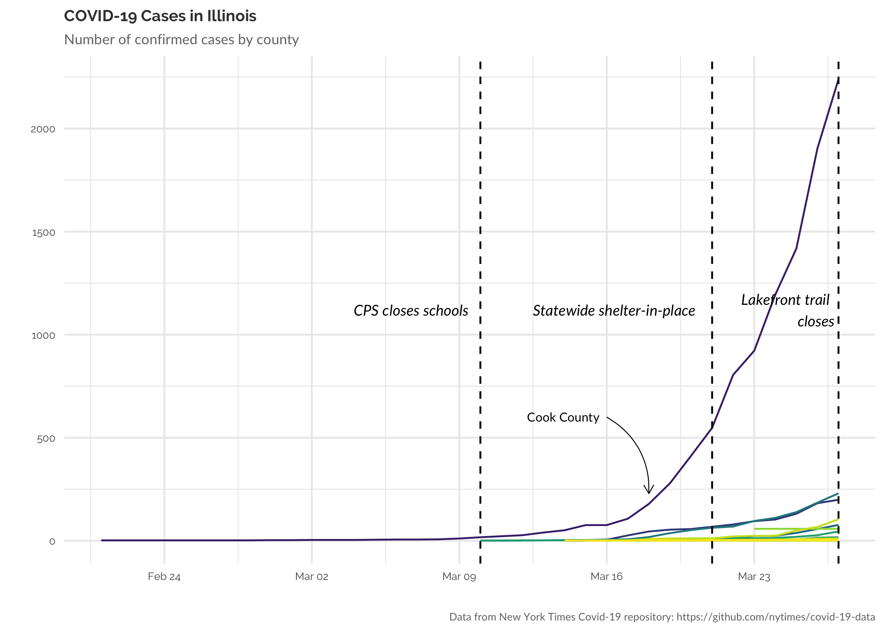
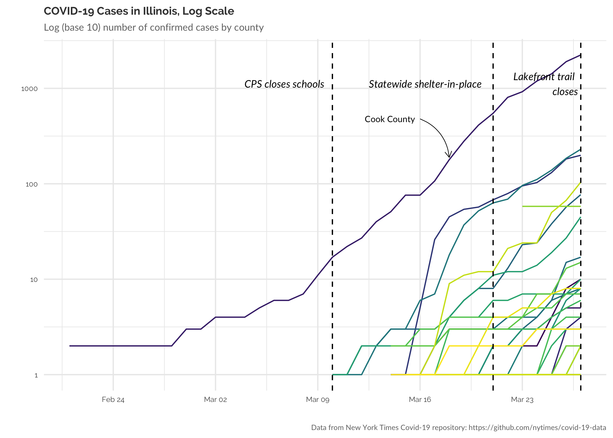
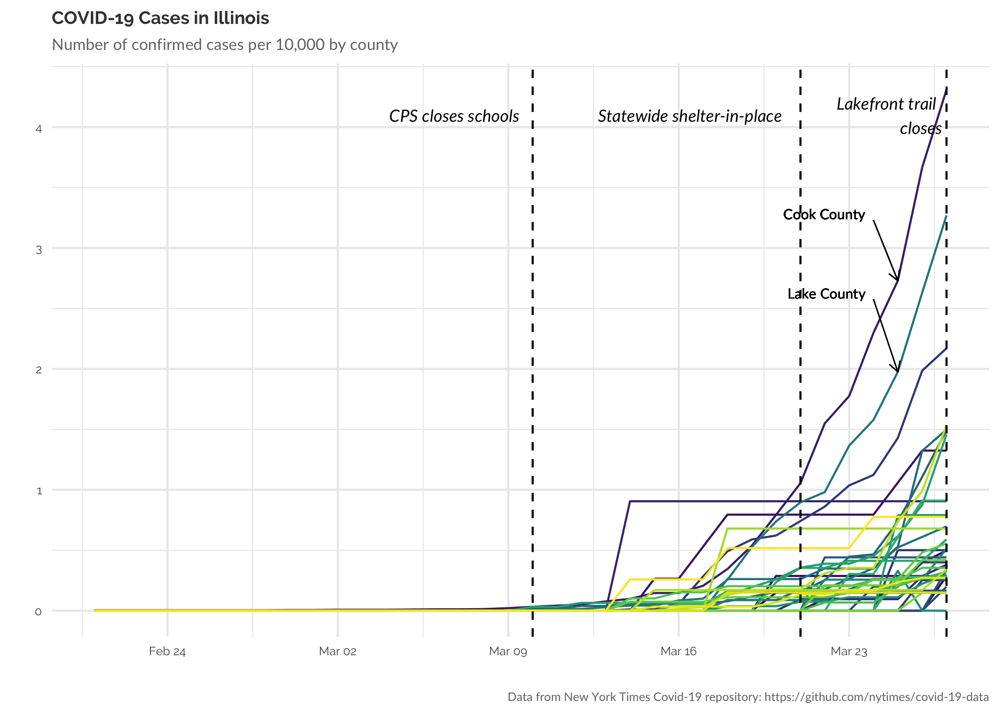
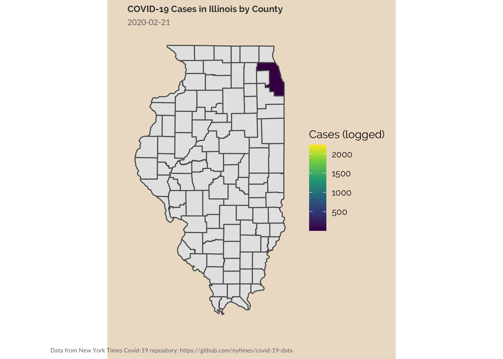
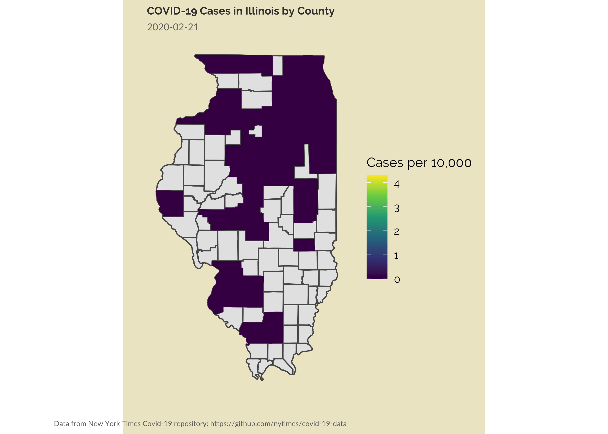

With the onset COVID-19 pandemic, many people are creating and sharing
visualizations help us understand and map the spread of the virus. I
live and work in Chicago, which has been under a “shelter-in-place”
order for over a week. Schools have been closed for two weeks. I’ve been
busy with the little ones and with work. But I thought I might visualize
the spread of COVID-19 in Illinois, which I have not yet seen done.

``` r
# Define ggplot theme
theme_set(
  theme_minimal() +
    theme(
      text = element_text(family = "Raleway"),
      axis.title.x = element_text(size = 10, hjust = 1),
      axis.title.y = element_text(size = 10),
      axis.text.x = element_text(size = 6),
      axis.text.y = element_text(size = 6),
      plot.title = element_text(size = 9, colour = "grey25", face = "bold"),
      plot.subtitle = element_text(family = "Lato", size = 8, colour = "grey45"),
      plot.caption = element_text(family = "Lato", size = 6, colour = "grey45")
    )
)
```

# Getting the data from the New York Times COVID-19 github repo

``` r
il <- read_csv("https://raw.githubusercontent.com/nytimes/covid-19-data/master/us-counties.csv") %>% 
  filter(state == "Illinois")

# il county census data
il_pop <- get_decennial(geography = "county", 
                        variables = "P001001", 
                        state = "IL",
                        geometry = TRUE) %>% 
  janitor::clean_names() %>% 
  transmute(geoid = geoid,
            population = value,
            geometry = geometry)
##   |                                                                              |                                                                      |   0%  |                                                                              |                                                                      |   1%  |                                                                              |=                                                                     |   1%  |                                                                              |=                                                                     |   2%  |                                                                              |==                                                                    |   2%  |                                                                              |==                                                                    |   3%  |                                                                              |==                                                                    |   4%  |                                                                              |===                                                                   |   4%  |                                                                              |===                                                                   |   5%  |                                                                              |====                                                                  |   5%  |                                                                              |====                                                                  |   6%  |                                                                              |=====                                                                 |   6%  |                                                                              |=====                                                                 |   7%  |                                                                              |=====                                                                 |   8%  |                                                                              |======                                                                |   8%  |                                                                              |======                                                                |   9%  |                                                                              |=======                                                               |   9%  |                                                                              |=======                                                               |  10%  |                                                                              |=======                                                               |  11%  |                                                                              |========                                                              |  11%  |                                                                              |========                                                              |  12%  |                                                                              |=========                                                             |  12%  |                                                                              |=========                                                             |  13%  |                                                                              |=========                                                             |  14%  |                                                                              |==========                                                            |  14%  |                                                                              |==========                                                            |  15%  |                                                                              |===========                                                           |  15%  |                                                                              |===========                                                           |  16%  |                                                                              |============                                                          |  16%  |                                                                              |============                                                          |  17%  |                                                                              |============                                                          |  18%  |                                                                              |=============                                                         |  18%  |                                                                              |=============                                                         |  19%  |                                                                              |==============                                                        |  19%  |                                                                              |==============                                                        |  20%  |                                                                              |==============                                                        |  21%  |                                                                              |===============                                                       |  21%  |                                                                              |===============                                                       |  22%  |                                                                              |================                                                      |  22%  |                                                                              |================                                                      |  23%  |                                                                              |=================                                                     |  24%  |                                                                              |=================                                                     |  25%  |                                                                              |==================                                                    |  25%  |                                                                              |==================                                                    |  26%  |                                                                              |===================                                                   |  27%  |                                                                              |===================                                                   |  28%  |                                                                              |====================                                                  |  28%  |                                                                              |====================                                                  |  29%  |                                                                              |=====================                                                 |  29%  |                                                                              |=====================                                                 |  30%  |                                                                              |=====================                                                 |  31%  |                                                                              |======================                                                |  31%  |                                                                              |======================                                                |  32%  |                                                                              |=======================                                               |  32%  |                                                                              |=======================                                               |  33%  |                                                                              |========================                                              |  34%  |                                                                              |========================                                              |  35%  |                                                                              |=========================                                             |  35%  |                                                                              |=========================                                             |  36%  |                                                                              |==========================                                            |  37%  |                                                                              |==========================                                            |  38%  |                                                                              |===========================                                           |  38%  |                                                                              |===========================                                           |  39%  |                                                                              |============================                                          |  39%  |                                                                              |============================                                          |  40%  |                                                                              |============================                                          |  41%  |                                                                              |=============================                                         |  41%  |                                                                              |=============================                                         |  42%  |                                                                              |==============================                                        |  42%  |                                                                              |==============================                                        |  43%  |                                                                              |==============================                                        |  44%  |                                                                              |===============================                                       |  44%  |                                                                              |===============================                                       |  45%  |                                                                              |================================                                      |  45%  |                                                                              |================================                                      |  46%  |                                                                              |=================================                                     |  46%  |                                                                              |=================================                                     |  47%  |                                                                              |=================================                                     |  48%  |                                                                              |==================================                                    |  48%  |                                                                              |==================================                                    |  49%  |                                                                              |===================================                                   |  49%  |                                                                              |===================================                                   |  50%  |                                                                              |===================================                                   |  51%  |                                                                              |====================================                                  |  51%  |                                                                              |====================================                                  |  52%  |                                                                              |=====================================                                 |  52%  |                                                                              |=====================================                                 |  53%  |                                                                              |=====================================                                 |  54%  |                                                                              |======================================                                |  54%  |                                                                              |======================================                                |  55%  |                                                                              |=======================================                               |  55%  |                                                                              |=======================================                               |  56%  |                                                                              |========================================                              |  56%  |                                                                              |========================================                              |  57%  |                                                                              |========================================                              |  58%  |                                                                              |=========================================                             |  58%  |                                                                              |=========================================                             |  59%  |                                                                              |==========================================                            |  59%  |                                                                              |==========================================                            |  60%  |                                                                              |==========================================                            |  61%  |                                                                              |===========================================                           |  61%  |                                                                              |===========================================                           |  62%  |                                                                              |============================================                          |  62%  |                                                                              |============================================                          |  63%  |                                                                              |=============================================                         |  64%  |                                                                              |=============================================                         |  65%  |                                                                              |==============================================                        |  65%  |                                                                              |==============================================                        |  66%  |                                                                              |===============================================                       |  67%  |                                                                              |===============================================                       |  68%  |                                                                              |================================================                      |  68%  |                                                                              |================================================                      |  69%  |                                                                              |=================================================                     |  69%  |                                                                              |=================================================                     |  70%  |                                                                              |=================================================                     |  71%  |                                                                              |==================================================                    |  71%  |                                                                              |==================================================                    |  72%  |                                                                              |===================================================                   |  72%  |                                                                              |===================================================                   |  73%  |                                                                              |====================================================                  |  74%  |                                                                              |====================================================                  |  75%  |                                                                              |=====================================================                 |  75%  |                                                                              |=====================================================                 |  76%  |                                                                              |======================================================                |  77%  |                                                                              |======================================================                |  78%  |                                                                              |=======================================================               |  78%  |                                                                              |=======================================================               |  79%  |                                                                              |========================================================              |  79%  |                                                                              |========================================================              |  80%  |                                                                              |========================================================              |  81%  |                                                                              |=========================================================             |  81%  |                                                                              |=========================================================             |  82%  |                                                                              |==========================================================            |  82%  |                                                                              |==========================================================            |  83%  |                                                                              |==========================================================            |  84%  |                                                                              |===========================================================           |  84%  |                                                                              |===========================================================           |  85%  |                                                                              |============================================================          |  85%  |                                                                              |============================================================          |  86%  |                                                                              |=============================================================         |  86%  |                                                                              |=============================================================         |  87%  |                                                                              |=============================================================         |  88%  |                                                                              |==============================================================        |  88%  |                                                                              |==============================================================        |  89%  |                                                                              |===============================================================       |  89%  |                                                                              |===============================================================       |  90%  |                                                                              |===============================================================       |  91%  |                                                                              |================================================================      |  91%  |                                                                              |================================================================      |  92%  |                                                                              |=================================================================     |  92%  |                                                                              |=================================================================     |  93%  |                                                                              |=================================================================     |  94%  |                                                                              |==================================================================    |  94%  |                                                                              |==================================================================    |  95%  |                                                                              |===================================================================   |  95%  |                                                                              |===================================================================   |  96%  |                                                                              |====================================================================  |  96%  |                                                                              |====================================================================  |  97%  |                                                                              |====================================================================  |  98%  |                                                                              |===================================================================== |  98%  |                                                                              |===================================================================== |  99%  |                                                                              |======================================================================|  99%  |                                                                              |======================================================================| 100%
```

``` r
il %>% 
  filter(cases != 0, date > "2020-02-20") %>% 
  ggplot(aes(x = date, y = cases, group = county)) +
  geom_line(aes(color = county)) +
  geom_vline(xintercept = as.Date("2020-03-10"), linetype = 2) +
  geom_vline(xintercept = as.Date("2020-03-21"), linetype = 2) +
  geom_vline(xintercept = as.Date("2020-03-27"), linetype = 2) +
  scale_color_viridis_d(guide = FALSE) +annotate("text", 
                                                 label = "CPS closes schools", 
                                                 x = as.Date("2020-03-10"), 
                                                 y = max(il$cases)*0.5,
                                                 hjust = 1.1, 
                                                 size = 3,
                                                 family = "Lato",
                                                 fontface = "italic") +
  annotate("text", 
           label = "Statewide shelter-in-place", 
           x = as.Date("2020-03-21"), 
           y = max(il$cases)*0.5,
           hjust = 1.1, 
           size = 3,
           family = "Lato",
           fontface = "italic") +
  annotate("text", 
           label = "Lakefront trail\ncloses", 
           x = as.Date("2020-03-27"), 
           y = max(il$cases)*0.5,
           hjust = 1.1, 
           size = 3,
           family = "Lato",
           fontface = "italic") +
  annotate("curve", 
           x = as.Date("2020-03-16"), 
           y = 600, 
           xend = as.Date("2020-03-18"), 
           yend = (il$cases[il$county == "Cook" & il$date == "2020-03-18"] + 50), 
           size = 0.25, 
           curvature = -.3, 
           arrow = arrow(length = unit(2, "mm"))) + 
  annotate("text", 
           label = "Cook County", 
           x = as.Date("2020-03-16"), 
           y = 600, 
           hjust = 1.1, 
           size = 2.5, 
           family = "Lato") +
  labs(x = "", y = "", 
       title = "COVID-19 Cases in Illinois",
       subtitle = "Number of confirmed cases by county",
       caption = "Data from New York Times Covid-19 repository: https://github.com/nytimes/covid-19-data")
```

<!-- -->

# Using a log scale for number of cases

``` r
il %>% 
  filter(cases != 0, date > "2020-02-20") %>% 
  ggplot(aes(x = date, y = cases, group = county)) +
  geom_line(aes(color = county)) +
  geom_vline(xintercept = as.Date("2020-03-10"), linetype = 2) +
  geom_vline(xintercept = as.Date("2020-03-21"), linetype = 2) +
  geom_vline(xintercept = as.Date("2020-03-27"), linetype = 2) +
  scale_color_viridis_d(guide = FALSE) +
  scale_y_log10() +
  annotate("text", 
           label = "CPS closes schools", 
           x = as.Date("2020-03-10"), 
           y = max(il$cases)*0.5,
           hjust = 1.1, 
           size = 3,
           family = "Lato",
           fontface = "italic") +
  annotate("text", 
           label = "Statewide shelter-in-place", 
           x = as.Date("2020-03-21"), 
           y = max(il$cases)*0.5,
           hjust = 1.1, 
           size = 3,
           family = "Lato",
           fontface = "italic") +
  annotate("text", 
           label = "Lakefront trail\ncloses", 
           x = as.Date("2020-03-27"), 
           y = max(il$cases)*0.5,
           hjust = 1.1, 
           size = 3,
           family = "Lato",
           fontface = "italic") +
  annotate("curve", 
           x = as.Date("2020-03-16"), 
           y = (il$cases[il$county == "Cook" & il$date == "2020-03-18"] + 300), 
           xend = as.Date("2020-03-18"), 
           yend = (il$cases[il$county == "Cook" & il$date == "2020-03-18"] + 10), 
           size = 0.25, 
           curvature = -.3, 
           arrow = arrow(length = unit(2, "mm"))) + 
  annotate("text", 
           label = "Cook County", 
           x = as.Date("2020-03-16"), 
           y = (il$cases[il$county == "Cook" & il$date == "2020-03-18"] + 300), 
           hjust = 1.1, 
           size = 2.5, 
           family = "Lato") +
  labs(x = "", y = "", 
       title = "COVID-19 Cases in Illinois, Log Scale",
       subtitle = "Log (base 10) number of confirmed cases by county",
       caption = "Data from New York Times Covid-19 repository: https://github.com/nytimes/covid-19-data")
```

<!-- -->

## Using number of cases per 10,000

``` r
il_per_cap <-
  il %>% 
  filter(date > "2020-02-20") %>% 
  complete(county, nesting(date), fill = list(cases = 0, deaths = 0)) %>%
  arrange(date, county) %>% 
  select(-fips) %>% 
  left_join(il %>% select(county, fips), by = "county") %>% 
  left_join(il_pop %>% select(geoid, population), 
            by = c("fips" = "geoid")) %>% 
  mutate(cases_per = (cases/population) * 10000) 

il_per_cap %>% 
  ggplot(aes(x = date, y = cases_per, group = county)) +
  geom_line(aes(color = county)) +
  geom_vline(xintercept = as.Date("2020-03-10"), linetype = 2) +
  geom_vline(xintercept = as.Date("2020-03-21"), linetype = 2) +
  geom_vline(xintercept = as.Date("2020-03-27"), linetype = 2) +
  scale_color_viridis_d(guide = FALSE) +
    annotate("text", 
             label = "CPS closes schools", 
             x = as.Date("2020-03-10"), 
             y = max(il_per_cap$cases_per, na.rm = TRUE)*0.95,
             hjust = 1.1, 
             size = 3,
             family = "Lato",
             fontface = "italic") +
  annotate("text", 
           label = "Statewide shelter-in-place", 
           x = as.Date("2020-03-21"), 
           y = max(il_per_cap$cases_per, na.rm = TRUE)*0.95,
           hjust = 1.1, 
           size = 3,
           family = "Lato",
           fontface = "italic") +
  annotate("text", 
           label = "Lakefront trail\ncloses", 
           x = as.Date("2020-03-27"), 
           y = max(il_per_cap$cases_per, na.rm = TRUE)*0.95,
           hjust = 1.1, 
           size = 3,
           family = "Lato",
           fontface = "italic") +
  annotate("segment", 
             x = as.Date("2020-03-24"), 
             y = (il_per_cap$cases_per[il_per_cap$county == "Cook" & il_per_cap$date == "2020-03-25"] + 0.5), 
             xend = as.Date("2020-03-25"), 
             yend = (il_per_cap$cases_per[il_per_cap$county == "Cook" & il_per_cap$date == "2020-03-25"]), 
             size = 0.25,  
             arrow = arrow(length = unit(2, "mm"))) + 
  annotate("text", 
           label = "Cook County", 
           x = as.Date("2020-03-24"), 
           y = (il_per_cap$cases_per[il_per_cap$county == "Cook" & il_per_cap$date == "2020-03-25"] + 0.55), 
           hjust = 1.1, 
           size = 2.5, 
           family = "Lato") +
  annotate("segment", 
             x = as.Date("2020-03-24"), 
             y = (il_per_cap$cases_per[il_per_cap$county == "Lake" & il_per_cap$date == "2020-03-25"] + 0.6), 
             xend = as.Date("2020-03-25"), 
             yend = (il_per_cap$cases_per[il_per_cap$county == "Lake" & il_per_cap$date == "2020-03-25"]), 
             size = 0.25,  
             arrow = arrow(length = unit(2, "mm"))) + 
  annotate("text", 
           label = "Lake County", 
           x = as.Date("2020-03-24"), 
           y = (il_per_cap$cases_per[il_per_cap$county == "Lake" & il_per_cap$date == "2020-03-25"] + 0.65), 
           hjust = 1.1, 
           size = 2.5, 
           family = "Lato") +
  labs(x = "", y = "", 
       title = "COVID-19 Cases in Illinois",
       subtitle = "Number of confirmed cases per 10,000 by county",
       caption = "Data from New York Times Covid-19 repository: https://github.com/nytimes/covid-19-data")
```

<!-- -->

``` r
il_anim <- il %>% 
  filter(cases != 0, date > "2020-02-20") %>% 
  mutate(log_cases = log10(cases)) %>% 
  left_join(il_pop %>% select(geoid, population), 
            by = c("fips" = "geoid")) %>% 
  ggplot() +
  geom_sf(data = il_pop, aes(geometry = geometry)) +
  geom_sf(aes(geometry = geometry, fill = cases)) +
  scale_fill_viridis_c(name = "Cases (logged)") +  
  labs(x = "", y = "", 
       title = "COVID-19 Cases in Illinois by County",
       subtitle = "{current_frame}",
       caption = "Data from New York Times Covid-19 repository: https://github.com/nytimes/covid-19-data") +
  transition_manual(date) +
  theme(plot.background = element_rect(fill = "antiquewhite2", color = NA),
        axis.ticks.x = element_blank(), 
        axis.text.x = element_blank(), 
        axis.text.y = element_blank(), 
        axis.ticks.y = element_blank(), 
        panel.grid.major = element_blank(),
        panel.grid.minor = element_blank())

animate(il_anim, fps = 5)
```

<!-- -->

``` r
il_anim <-
  il_per_cap %>% 
  ggplot() +
  geom_sf(data = il_pop, aes(geometry = geometry)) +
  geom_sf(aes(geometry = geometry, fill = cases_per), color = NA) +
  scale_fill_viridis_c(name = "Cases per 10,000") +  
  labs(x = "", y = "", 
       title = "COVID-19 Cases in Illinois by County",
       subtitle = "{current_frame}",
       caption = "Data from New York Times Covid-19 repository: https://github.com/nytimes/covid-19-data") +
  transition_manual(date) +
  theme(plot.background = element_rect(fill = "cornsilk2", color = NA),
        axis.ticks.x = element_blank(), 
        axis.text.x = element_blank(), 
        axis.text.y = element_blank(), 
        axis.ticks.y = element_blank(), 
        panel.grid.major = element_blank(),
        panel.grid.minor = element_blank())

animate(il_anim, fps = 5)
```

<!-- -->
